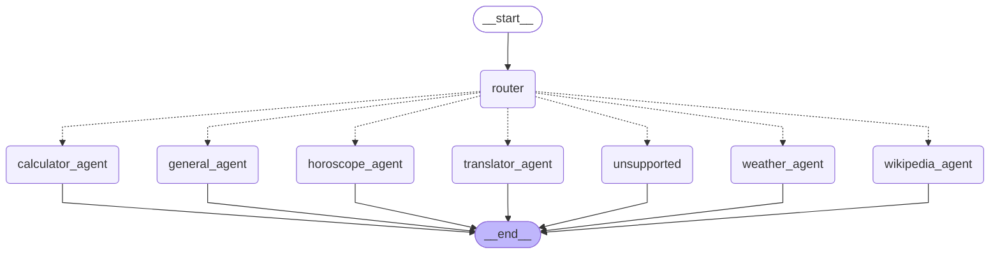

# Grafo Supervisore Multiagente

Questo grafo mostra il flusso del supervisore che coordina i vari agenti:

```mermaid
%%{init: {'flowchart': {'curve': 'linear'}}}%%
graph TD;
	__start__([<p>__start__</p>]):::first
	router(router)
	weather_agent(weather_agent)
	horoscope_agent(horoscope_agent)
	general_agent(general_agent)
	wikipedia_agent(wikipedia_agent)
	calculator_agent(calculator_agent)
	translator_agent(translator_agent)
	unsupported(unsupported)
	__end__([<p>__end__</p>]):::last
	__start__ --> router;
	calculator_agent --> __end__;
	general_agent --> __end__;
	horoscope_agent --> __end__;
	translator_agent --> __end__;
	unsupported --> __end__;
	weather_agent --> __end__;
	wikipedia_agent --> __end__;
	router -.-> weather_agent;
	router -.-> horoscope_agent;
	router -.-> wikipedia_agent;
	router -.-> calculator_agent;
	router -.-> translator_agent;
	router -.-> general_agent;
	router -.-> unsupported;
	classDef default fill:#f2f0ff,line-height:1.2
	classDef first fill-opacity:0
	classDef last fill:#bfb6fc

```
