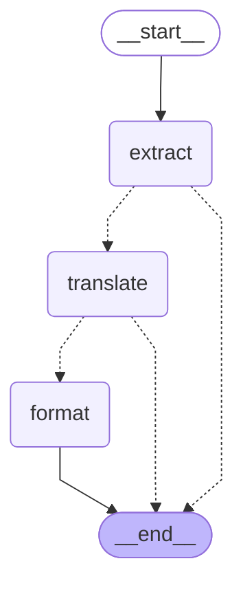

# Grafo Agente Traduttore

```mermaid
%%{init: {'flowchart': {'curve': 'linear'}}}%%
graph TD;
	__start__([<p>__start__</p>]):::first
	extract(extract)
	translate(translate)
	format(format)
	__end__([<p>__end__</p>]):::last
	__start__ --> extract;
	format --> __end__;
	extract -.-> translate;
	extract -.-> __end__;
	translate -.-> format;
	translate -.-> __end__;
	classDef default fill:#f2f0ff,line-height:1.2
	classDef first fill-opacity:0
	classDef last fill:#bfb6fc

```
