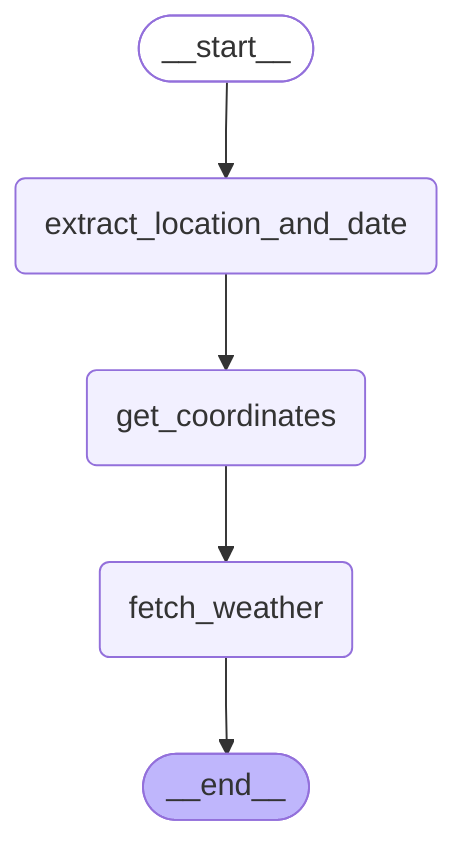

# Grafo Agente Meteo

Questo grafo mostra il flusso dell'agente meteo:

```mermaid
%%{init: {'flowchart': {'curve': 'linear'}}}%%
graph TD;
	__start__([<p>__start__</p>]):::first
	extract_location_and_date(extract_location_and_date)
	get_coordinates(get_coordinates)
	fetch_weather(fetch_weather)
	__end__([<p>__end__</p>]):::last
	__start__ --> extract_location_and_date;
	extract_location_and_date --> get_coordinates;
	fetch_weather --> __end__;
	get_coordinates --> fetch_weather;
	classDef default fill:#f2f0ff,line-height:1.2
	classDef first fill-opacity:0
	classDef last fill:#bfb6fc

```
